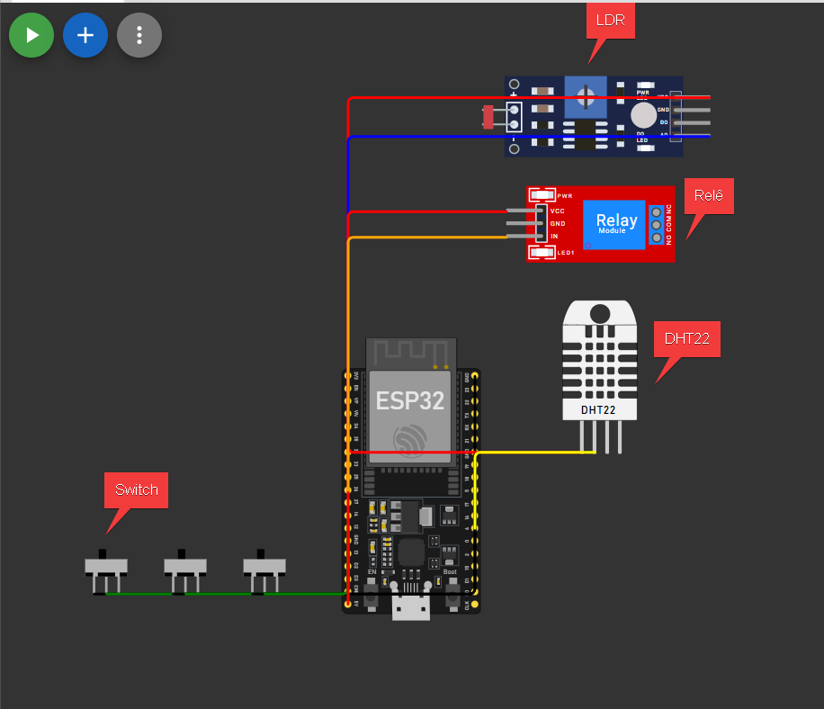
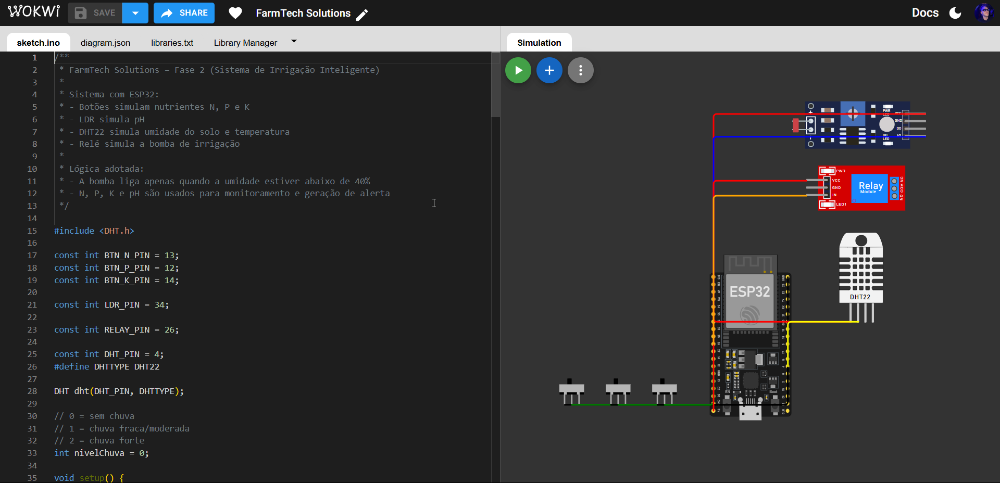

# 📸 FarmTech Solutions – Visão Visual do Projeto (Complementar)

## 🔗 Acesso ao Projeto no Wokwi

Acesse diretamente a simulação completa:

👉 https://wokwi.com/projects/461323572133054465

---

## 🧩 Visão Geral do Circuito

### Componentes identificados:

- **ESP32** → controlador principal
- **DHT22** → sensor de umidade e temperatura
- **LDR** → simulação de pH
- **Relé** → bomba de irrigação
- **Switches (NPK)** → simulam nutrientes

---

## 💻 Código e Simulação no Wokwi

### O que essa tela mostra:

- Código rodando no ESP32
- Monitor Serial exibindo:
  - Umidade
  - Temperatura
  - pH
  - NPK
  - Estado da bomba
- Componentes sendo manipulados em tempo real

---

## 🔄 Interação com o Sistema

### 🎛️ Sensores e controles:

#### 1. DHT22 (Umidade)

- Controlado por slider
- Define quando o solo está seco

#### 2. LDR (pH)

- Controlado por LUX
- Simula acidez do solo

#### 3. Switches (NPK)

- ON → nutriente presente
- OFF → nutriente ausente

#### 4. Serial Monitor (clima)

Digite:
0 → sem chuva  
1 → chuva moderada  
2 → chuva forte

---

## 🧪 Exemplo de Saída no Monitor Serial

Chuva prevista: SEM CHUVA  
Umidade: 17.0% Temperatura: 23.9C pH: 1.82  
N: Falta P: Falta K: Falta Solo: ALERTA  
Bomba: DESLIGADA  
Alerta: nutrientes NPK fora do ideal.  
Alerta: pH fora da faixa adequada.

---

## ⚙️ Comportamento Esperado

| Situação                     | Resultado       |
| ---------------------------- | --------------- |
| Solo seco + condições ideais | Bomba LIGADA    |
| Chuva forte                  | Bomba DESLIGADA |
| pH fora da faixa             | ALERTA          |
| NPK incompleto               | ALERTA          |
| Solo inadequado              | NÃO irriga      |

---

## 🎯 Objetivo deste README

Este documento complementa o README principal, apresentando:

- Estrutura visual do circuito
- Interface de simulação
- Forma de interação com o sistema
- Evidências de funcionamento

---

## 🧠 Conclusão Visual

O sistema demonstra, de forma prática:

- Integração entre sensores simulados
- Controle automatizado de irrigação
- Interação em tempo real
- Aplicação de lógica baseada em múltiplas variáveis
