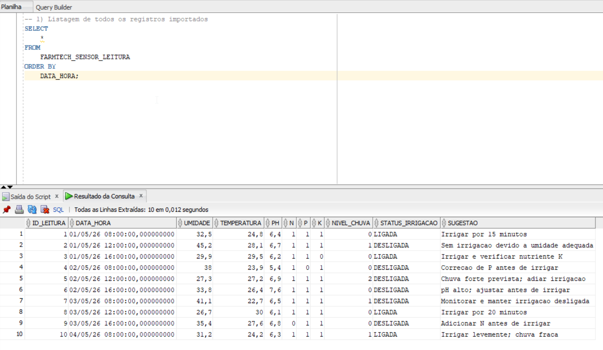
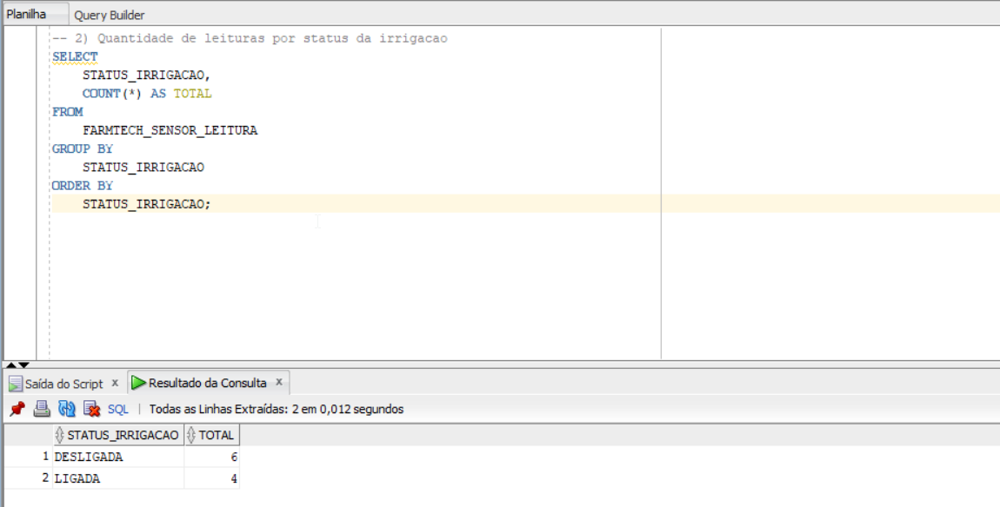
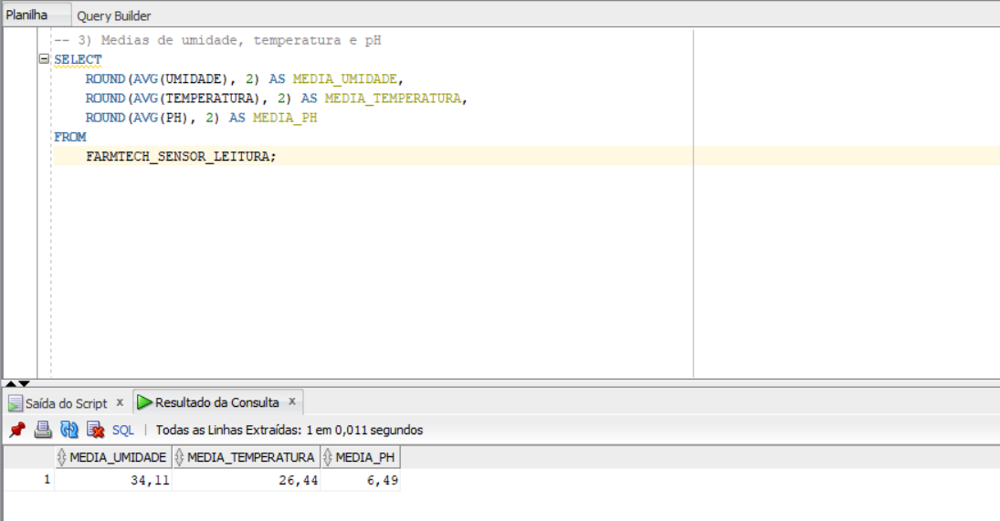
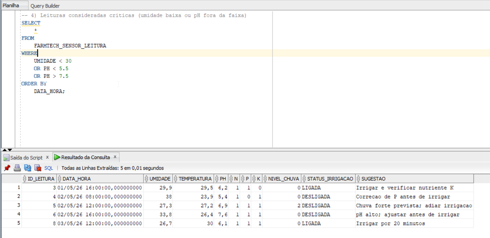
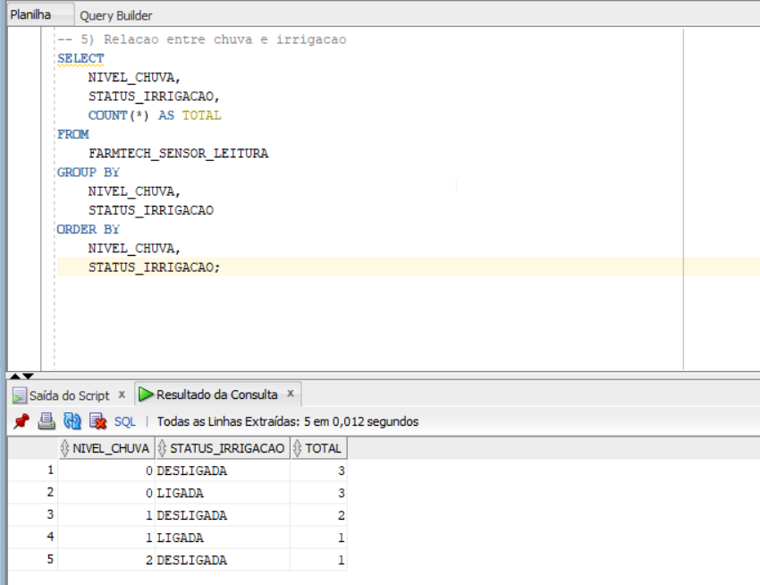
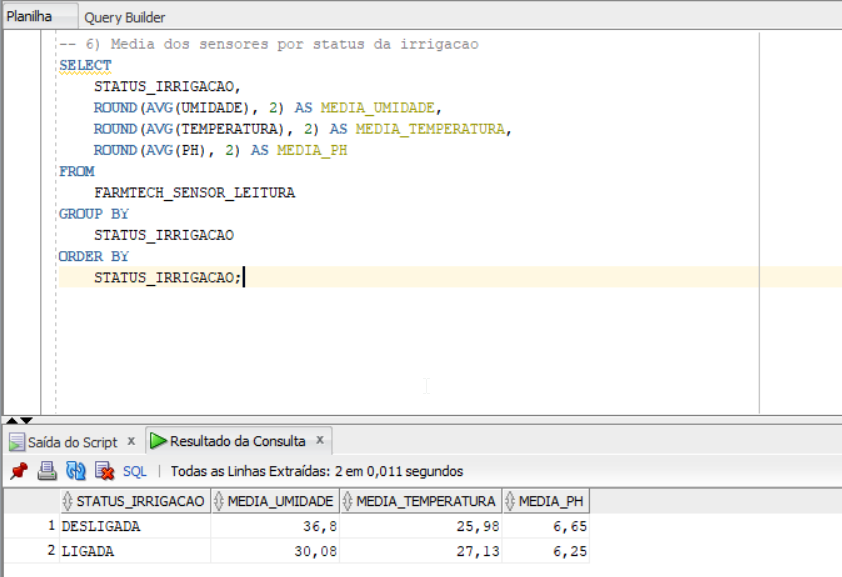
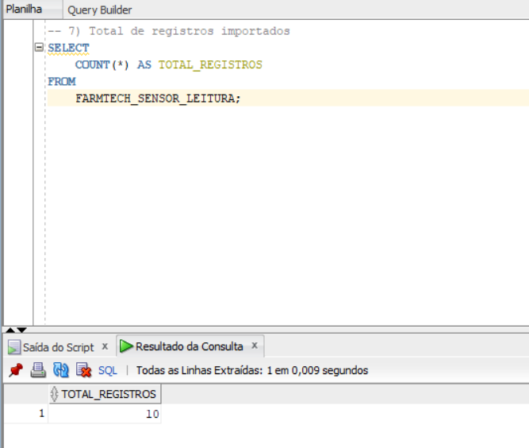

# Consultas SQL — FarmTech Solutions Fase 3

Este documento apresenta as consultas SQL utilizadas para validar os dados importados no banco Oracle. As consultas foram feitas sobre a tabela `FARMTECH_SENSOR_LEITURA`, criada a partir dos dados simulados da Fase 2.

A proposta deste arquivo é documentar o que cada consulta faz e indicar onde inserir os prints exigidos na entrega.

---

## Tabela utilizada

```sql
FARMTECH_SENSOR_LEITURA
```

A tabela armazena leituras simuladas de sensores agrícolas:

| Campo | Descrição |
|---|---|
| `ID_LEITURA` | Identificador da leitura. |
| `DATA_HORA` | Data e hora da coleta. |
| `UMIDADE` | Umidade simulada do solo. |
| `TEMPERATURA` | Temperatura ambiente. |
| `PH` | pH simulado do solo. |
| `N` | Presença de nitrogênio. |
| `P` | Presença de fósforo. |
| `K` | Presença de potássio. |
| `NIVEL_CHUVA` | Nível de chuva previsto. |
| `STATUS_IRRIGACAO` | Status da irrigação. |
| `SUGESTAO` | Recomendação de ação. |

## Consulta 01 — Listagem de todos os registros

### Objetivo

Exibir todos os registros cadastrados/importados na tabela. Essa consulta comprova que os dados da Fase 2 foram armazenados no Oracle.

### SQL

```sql
SELECT
    *
FROM
    FARMTECH_SENSOR_LEITURA
ORDER BY
    DATA_HORA;
```

### O que observar no resultado

O resultado deve mostrar as colunas de sensores, status de irrigação e sugestões de ação. A ordenação por `DATA_HORA` facilita a leitura cronológica dos dados.

### Print



---

## Consulta 02 — Quantidade de leituras por status da irrigação

### Objetivo

Contar quantas leituras resultaram em irrigação ligada ou desligada.

### SQL

```sql
SELECT
    STATUS_IRRIGACAO,
    COUNT(*) AS TOTAL
FROM
    FARMTECH_SENSOR_LEITURA
GROUP BY
    STATUS_IRRIGACAO
ORDER BY
    STATUS_IRRIGACAO;
```

### O que observar no resultado

Essa consulta mostra a distribuição dos registros entre `LIGADA` e `DESLIGADA`. Ela ajuda a entender se a regra de irrigação está sendo aplicada de forma coerente.

### Print



---

## Consulta 03 — Médias dos sensores principais

### Objetivo

Calcular as médias de umidade, temperatura e pH com base nos registros armazenados.

### SQL

```sql
SELECT
    ROUND(AVG(UMIDADE), 2) AS MEDIA_UMIDADE,
    ROUND(AVG(TEMPERATURA), 2) AS MEDIA_TEMPERATURA,
    ROUND(AVG(PH), 2) AS MEDIA_PH
FROM
    FARMTECH_SENSOR_LEITURA;
```

### O que observar no resultado

A consulta apresenta uma visão geral das condições médias do solo e do ambiente. Esses indicadores também aparecem na dashboard Streamlit.

### Print



---

## Consulta 04 — Leituras críticas

### Objetivo

Identificar situações consideradas críticas, como umidade muito baixa ou pH fora da faixa adequada.

### SQL

```sql
SELECT
    *
FROM
    FARMTECH_SENSOR_LEITURA
WHERE
    UMIDADE < 30
    OR PH < 5.5
    OR PH > 7.5
ORDER BY
    DATA_HORA;
```

### Critérios usados

| Critério | Significado |
|---|---|
| `UMIDADE < 30` | Solo muito seco. |
| `PH < 5.5` | Solo ácido demais. |
| `PH > 7.5` | Solo alcalino demais. |

### O que observar no resultado

As linhas retornadas indicam situações em que o sistema deve gerar atenção antes de irrigar ou antes de manter o cultivo nas condições atuais.

### Print



---

## Consulta 05 — Relação entre chuva e irrigação

### Objetivo

Avaliar como o nível de chuva influencia o status da irrigação.

### SQL

```sql
SELECT
    NIVEL_CHUVA,
    STATUS_IRRIGACAO,
    COUNT(*) AS TOTAL
FROM
    FARMTECH_SENSOR_LEITURA
GROUP BY
    NIVEL_CHUVA,
    STATUS_IRRIGACAO
ORDER BY
    NIVEL_CHUVA,
    STATUS_IRRIGACAO;
```

### Legenda do campo `NIVEL_CHUVA`

| Valor | Significado |
|---|---|
| `0` | Sem chuva |
| `1` | Chuva fraca/moderada |
| `2` | Chuva forte |

### O que observar no resultado

A consulta permite verificar se, em cenários com chuva forte, a irrigação tende a permanecer desligada. Também ajuda a validar a lógica do protótipo ESP32.

### Print sugerido



---

## Consulta 06 — Média dos sensores por status da irrigação

### Objetivo

Comparar as médias dos sensores quando a irrigação está ligada e quando está desligada.

### SQL

```sql
SELECT
    STATUS_IRRIGACAO,
    ROUND(AVG(UMIDADE), 2) AS MEDIA_UMIDADE,
    ROUND(AVG(TEMPERATURA), 2) AS MEDIA_TEMPERATURA,
    ROUND(AVG(PH), 2) AS MEDIA_PH
FROM
    FARMTECH_SENSOR_LEITURA
GROUP BY
    STATUS_IRRIGACAO
ORDER BY
    STATUS_IRRIGACAO;
```

### O que observar no resultado

Essa consulta ajuda a justificar a tomada de decisão. Normalmente, leituras com irrigação ligada devem estar associadas a menor umidade, desde que as demais condições estejam adequadas.



---

## Consulta 07 — Total de registros importados

### Objetivo

Validar a quantidade de linhas gravadas no banco depois da importação via Python.

### SQL

```sql
SELECT
    COUNT(*) AS TOTAL_REGISTROS
FROM
    FARMTECH_SENSOR_LEITURA;
```

### O que observar no resultado

O valor retornado deve ser igual à quantidade de registros existentes no arquivo `data/sensores_fase2.csv`, desconsiderando o cabeçalho.

### Print sugerido



---

# Conclusão das consultas

As consultas SQL comprovam que os dados simulados da Fase 2 foram estruturados em uma tabela relacional Oracle. Elas também permitem analisar a situação da irrigação, identificar leituras críticas, calcular médias dos sensores e validar a quantidade de registros importados.

Com isso, o projeto demonstra o uso prático de banco de dados relacional aplicado ao agronegócio, conectando sensores, processamento em Python, análise SQL e visualização em dashboard.
